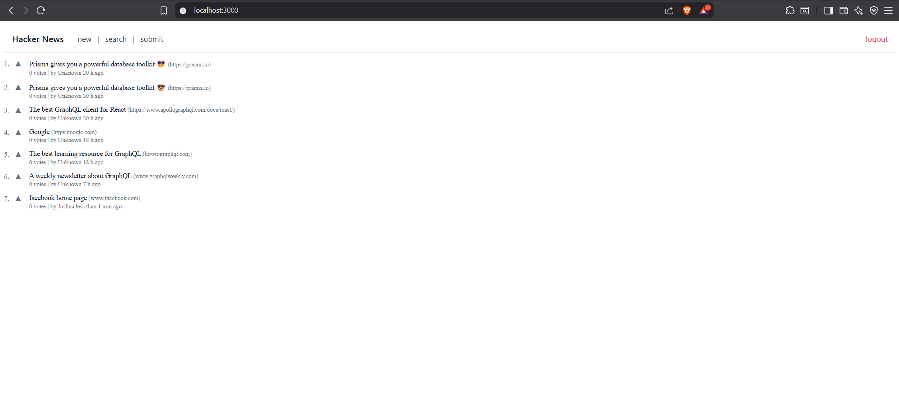

# Hacker News Clone 🚀

A simplified clone of Hacker News built with [Next.js](https://nextjs.org/), [TypeScript](https://www.typescriptlang.org/), [Apollo Client](https://www.apollographql.com/docs/react/), and [GraphQL](https://graphql.org/). Styled using [Tachyons](https://tachyons.io/) and TailwindCSS utilities.

## ✨ Features

- 🔍 Search and filter news links using GraphQL queries
- ⚡ Instant load with Apollo `useLazyQuery`
- 💾 Persistent state with Apollo Client Cache
- 🧠 Clear and maintainable TypeScript support
- 🎨 Minimalist UI styled with Tachyons
- 🔗 Vote and post links (in future iterations)
- 📦 Modular, component-driven architecture

---

## 📁 Project Structure

```

.
├── components/
│ ├── Link.tsx # Individual link card
│ └── Search.tsx # Search bar + result listing
├── pages/
│ ├── index.tsx # Home page
│ └── \_app.tsx # App wrapper (ApolloProvider, global styles)
├── styles/
│ └── globals.css # Global styles using Tailwind + Tachyons
├── lib/
│ └── apollo.ts # Apollo client configuration
├── graphql/
│ └── queries.ts # GraphQL queries
├── public/
└── tsconfig.json

```

---

## 🛠️ Technologies Used

- **Next.js** – React framework for SSR and fast routing
- **TypeScript** – Static type-checking for safety and scalability
- **Apollo Client** – State management and GraphQL queries
- **GraphQL** – Efficient data fetching from backend
- **Tachyons CSS** – Utility-first CSS framework
- **Tailwind CSS** – Additional global utility styling

---

## 🚀 Getting Started

### 1. Clone the repository

```bash
git clone https://github.com/josh-Alhassan/hackernews-clone.git
cd hackernews-clone
```

### 2. Install dependencies

```bash
yarn install
```

> You can also use `npm install` if you're not using Yarn.

### 3. Run the development server

```bash
yarn dev
```

Open your browser and navigate to:
📍 [http://localhost:3000](http://localhost:3000)

---

## 🔧 Environment Variables

Make sure to configure your `.env.local` file with your GraphQL endpoint:

```
NEXT_PUBLIC_GRAPHQL_ENDPOINT=https://your-graphql-api.com/graphql
```

---

## 🧪 Running Tests (Optional)

If tests are added:

```bash
yarn test
```

---

## 📸 Screenshots



---

## 📌 Roadmap

- [x] Basic Search functionality
- [x] Authentication with JWT
- [x] Link voting system
- [ ] Add pagination
- [x] Backend mutation for link submission

---

## 🤝 Contributing

1. Fork the project
2. Create your feature branch `git checkout -b feature/awesome-feature`
3. Commit your changes `git commit -m 'feat: add awesome feature'`
4. Push to the branch `git push origin feature/awesome-feature`
5. Open a Pull Request 🚀

---

## 📜 License

This project is licensed under the MIT License. See the [LICENSE](./LICENSE) file for details.

---

## 👨‍💻 Author

**Joshua Abel Alhassan**
📫 [@Josh_script](https://twitter.com/@josh_script) | 🌐 [Portfolio](https://alhassanjoshua.surge.sh)
Built with ❤️ and a lot of debugging.

---

## ⭐️ Show your support

If you liked this project, consider giving it a ⭐️ on GitHub and sharing it with others!

```

```
